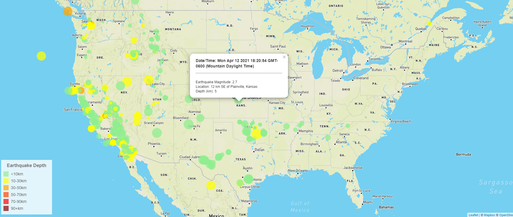
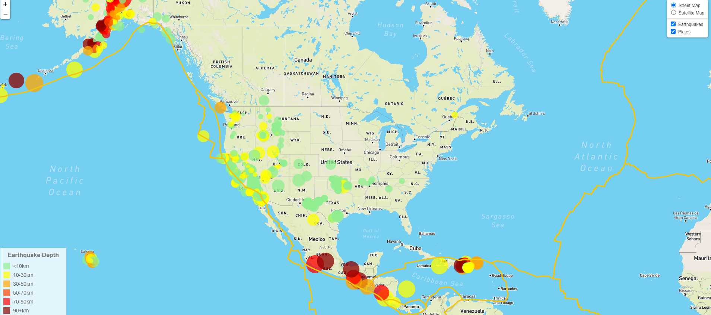

# University of Denver Data Analytics: Visualizing Geo Mapping Data with Leaflet

# Overview
This project consists of creating an interactive map with data pertaining to earthquakes, tectonic plates and seismic activity from two different sources. The challenge is to use coordinates from the data to plot earthquake activity and the locations of the earth's plates. 

# Development Toolkit
## Matchbox
## Leaflet
## JavaScript
## D3
## HTML
## CSS
---

## Main Task
The USGS is interested in building a new set of tools that will allow them to visualize their earthquake data. They collect a massive amount of data from all over the world each day, but they lack a meaningful way of displaying it. Their hope is that being able to visualize their data will allow them to better educate the public and other government organizations (and hopefully secure more funding..) on issues facing our planet.

### Level 1: Basic Visualization

Your first task is to visualize an earthquake data set.

1. **Get your data set**
   The USGS provides earthquake data in a number of different formats, updated every 5 minutes. Visit the [USGS GeoJSON Feed](http://earthquake.usgs.gov/earthquakes/feed/v1.0/geojson.php) page and pick a data set to visualize. When you click on a data set, for example 'All Earthquakes from the Past 7 Days', you will be given a JSON representation of that data. You will be using the URL of this JSON to pull in the data for our visualization.

 

2. **Import & Visualize the Data**

   Create a map using Leaflet that plots all of the earthquakes from your data set based on their longitude and latitude.

   * Your data markers should reflect the magnitude of the earthquake by their size and and depth of the earth quake by color. Earthquakes with higher magnitudes should appear larger and earthquakes with greater depth should appear darker in color.

   * Include popups that provide additional information about the earthquake when a marker is clicked.

   * Create a legend that will provide context for your map data.

- - -

### Level 2: More Data 

The USGS wants you to plot a second data set on your map to illustrate the relationship between tectonic plates and seismic activity. You will need to pull in a second data set and visualize it along side your original set of data. Data on tectonic plates can be found at <https://github.com/fraxen/tectonicplates>.

In this step we are going to..

* Plot a second data set on our map.

* Add a number of base maps to choose from as well as separate out our two different data sets into overlays that can be turned on and off independently.

* Add layer controls to our map.

## Final Interactive Map
- - -

